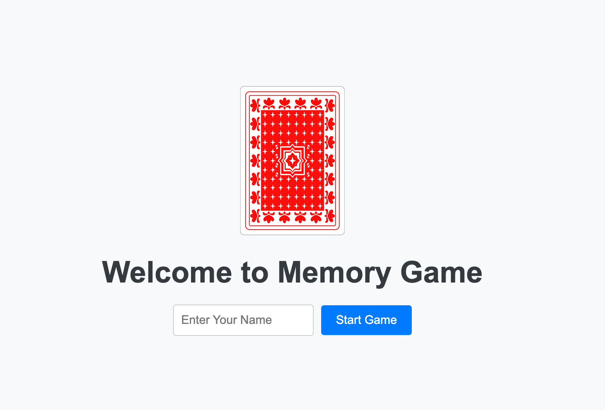
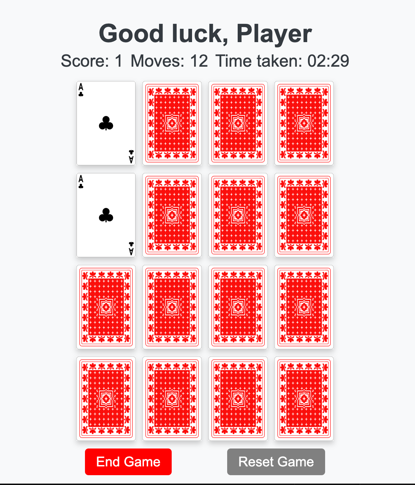
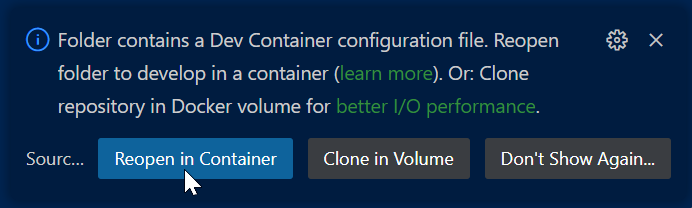

# Memory Game

Welcome to our Memory Game challenge! This is a React application written in TypeScript. We're excited to see how you can enhance it during the event.

## Challenge Objectives

The goal of this challenge is to build a memory game using GitHub Copilot in React and TypeScript. The game is based on the classic card game where players need to match pairs of cards.

### Rules of the game

1. The game should have a grid of cards that are face down and randomly placed.
2. When a player clicks on a card, it should flip over to reveal the image on the other side.
3. The player should then click on another card to try to match the images.
4. If the images match, the cards should stay face up.
5. If the images do not match, the cards should flip back over.
6. The game ends when all pairs of cards have been matched.

The matching _images_ will be playing cards of the same suit and number.

To complete this challenge, you will need to implement the game logic and user interface that includes the required features listed below. You can also add any additional features you think would enhance the game.

## Basic Requirements

The game should have the following required features:
- A way to ask, store and display the player's name
- A grid of cards that are randomly placed and face down.
- The ability to flip over cards to reveal the image on the other side.
- Logic to check if the images on two cards match.
- A way to keep track of the number of moves made by the player.
- A way to keep track of the time taken to complete the game.
- A scoring system based on the number of moves and time taken.
- A way to reset the game and start a new game.
- A way to end the game.

### Splash Screen


### Finished Game Screen


## Getting Started

These instructions will get you a copy of the project up and running on your local machine for development and testing purposes.

To help you get started, we have provided a basic scafolding for the game. You can find the source code in the `src` directory. The `App.tsx` file contains the main component of the application including a starting point for the splash screen, main game screen and an end game screen.


### Prerequisites

You will need the following tools:

- [Visual Studio Code](https://code.visualstudio.com/download)
- [Node.js and npm](https://nodejs.org/en/download/)
- [Git](https://git-scm.com/downloads)

### Installing & Running

1. Clone the repo:

```
git clone https://github.com/_your org name_/advanced_typescript-react_techniques_with_copilot.git
```

2. Navigate to the project directory:

```
cd hackathon-typescriptreact-memorygame
```

3. Open the project in Visual Studio Code

```bash
code .
```

4. Reopen the project in the DevContainer



5. Start the server:

```
npm start
```

## Using GitHub and GitHub Copilot

GitHub is a web-based hosting service for version control. You can learn more about how to use GitHub repositories [here](https://docs.github.com/en/github).

[GitHub Copilot](https://copilot.github.com/) is your AI pair programmer. With GitHub Copilot, you can write code faster with fewer errors. It's a great tool to use during a hackathon!

## React and TypeScript

This project is built with React and TypeScript. If you're new to these technologies, here are some resources to get you started:

- [React Documentation](https://reactjs.org/docs/getting-started.html)
- [TypeScript Documentation](https://www.typescriptlang.org/docs/)


Happy coding!
